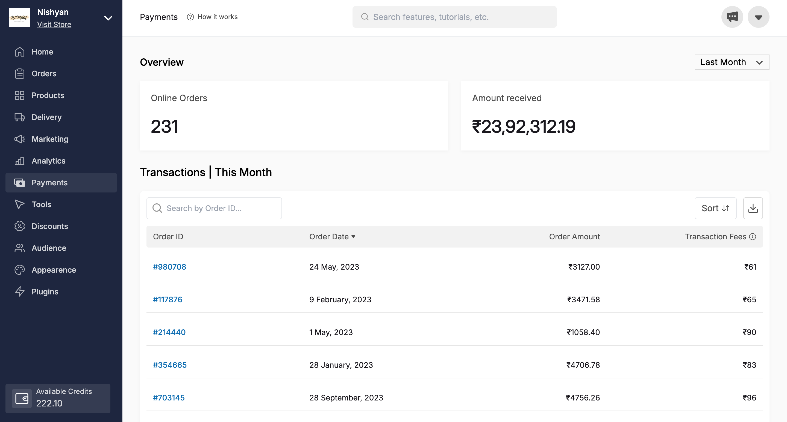
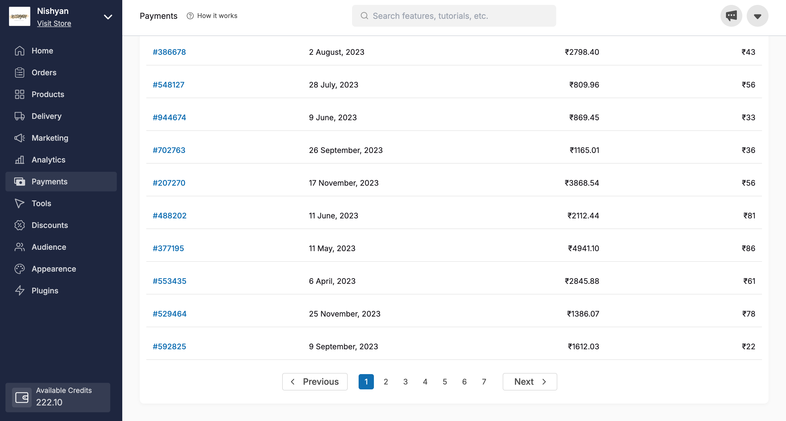

# payments-cashfree

This mini project was made as a part of Frontend Assignment of Dukaan : [Link](https://twitter.com/subhashchy/status/1744308069751025894)

[Live Website](https://dukaan-assignment-payments-cashfree.vercel.app/)

## A review of website

#### Header + Sidebar + Dashboard Overview



#### Pagination Overview



## Features :

- 🔥 Responsive
- 🔥 Includes pagination at the end in which all the indexes including previous and next are working
- 🔥 Tried to design as pixel-perfect as possible

## How to run?

Run the following commands :

```
npm install
npm start

Runs the app in the development mode.\
Open [http://localhost:3000](http://localhost:3000) to view it in your browser.

The page will reload when you make changes.\
You may also see any lint errors in the console.
```
